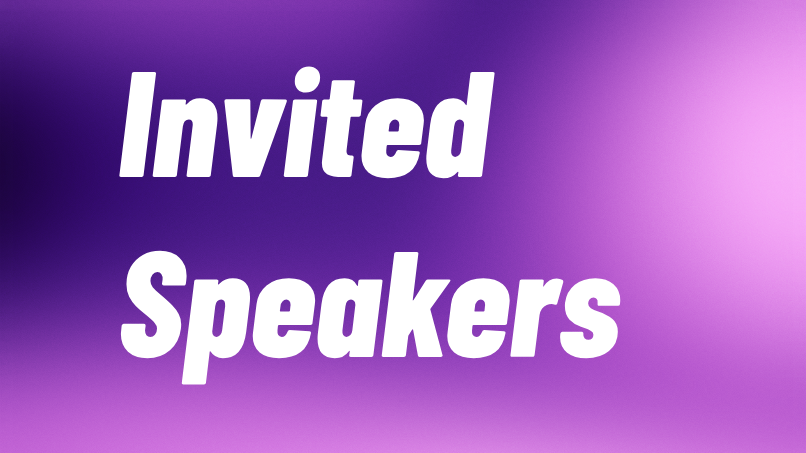

We hosted an exclusive seminar featuring five researchers with papers accepted at **ICLR 2025**, covering multimodal learning, graph foundation models, federated learning, LLM agent security, and cognitive limitations of LLMs.

**Date:** April 28, 2025 (Friday)
**Time:** 13:00 – 18:00
**Venue:** COM2-04-02 (Executive Classroom), 15 Computing Dr, Singapore 117418

<!-- truncate -->

## Speakers

  
  <h3 style={{marginTop: '0.75rem', marginBottom: '0.25rem'}}>Divyam Madaan</h3>
  
PhD Student @ New York University

  
  <h3 style={{marginTop: '0.75rem', marginBottom: '0.25rem'}}>Zhikai Chen</h3>
  
PhD Student @ Michigan State University

  
  <h3 style={{marginTop: '0.75rem', marginBottom: '0.25rem'}}>Zexi Li</h3>
  
PhD Student @ Zhejiang University

  
  <h3 style={{marginTop: '0.75rem', marginBottom: '0.25rem'}}>Hanrong Zhang</h3>
  
MS @ ZJU-UIUC

  
  <h3 style={{marginTop: '0.75rem', marginBottom: '0.25rem'}}>Jen-Tse Huang</h3>
  
Postdoc @ Johns Hopkins University

---

## Program

| Time | Session |
|------|---------|
| 12:30 – 13:10 | Tea and Snacks |
| 13:10 – 13:20 | Sharing by Xtra Group — Qian Wang |
| 13:20 – 13:50 | Divyam Madaan |
| 13:50 – 14:30 | Zhikai Chen *(Remote)* |
| 14:30 – 15:00 | Zexi Li |
| 15:00 – 15:30 | Break & Discussion |
| 15:30 – 16:00 | Hanrong Zhang |
| 16:00 – 16:30 | Jen-Tse Huang |
| 16:30 – 17:00 | Break & Discussion |
| 17:00 – | Dinner Buffet |

---

## Talks

### Multi-modal Learning: A Look Back and the Road Ahead
**Divyam Madaan** · PhD Student @ NYU, advised by Sumit Chopra and Kyunghyun Cho

Divyam's research focuses on models that learn from multiple modalities and generalize across distribution shifts, with an emphasis on healthcare applications. He holds an M.S. from KAIST and has published at ICML, NeurIPS, CVPR, and ICLR (oral and spotlight).

Supervised multi-modal learning maps multiple modalities to a target label. Prior work captures either *inter-modality* dependencies (relationships between modalities and the label) or *intra-modality* dependencies (relationships within a single modality) in isolation — but not both. This talk presents **I2M2** (Inter & Intra-Modality Modeling), a generative-model-based framework that integrates both types of dependencies, yielding improved predictions on real-world healthcare and vision-language datasets.

---

### Graph Foundation Models: Addressing Feature and Task Heterogeneity
**Zhikai Chen** · PhD Student @ Michigan State University, advised by Prof. Jiliang Tang *(Remote)*

Zhikai's research lies in graph machine learning and geometric deep learning, with a focus on scalable and transferable models for structured data. He has published at ICLR, NeurIPS, ICML, and LOG.

Foundation models achieve their power through *homogenization* (a unified framework) and *emergence* (capabilities that scale with size and data). Applying these ideas to graphs requires overcoming two core challenges: **feature heterogeneity** (diverse types and structures of graph data) and **task heterogeneity** (a single model excelling at multiple tasks). This talk argues that task heterogeneity is the deeper theoretical obstacle and charts a path toward true graph foundation models.

---

### Foundation Models under Model Parameter Perspective: Editing, Fusion, and Generation
**Zexi Li** · PhD Student @ Zhejiang University, Visiting Researcher @ University of Cambridge

Zexi focuses on LLMs, optimization, generalization, and personalization under federated and trustworthy setups, through the lens of parameter space and learning dynamics. He has 9 co-first-author papers at ICML, ICCV, NeurIPS, Cell Press Patterns, and IEEE TMC.

Understanding model parameters helps uncover the "physics" of AI. This talk covers three perspectives: (1) **lifelong editing** of LLMs' parametric memory, (2) **parameter fusion** for better federated learning, and (3) **personalized model generation** via diffusion models over parameter space.

---

### Agent Security Bench (ASB): Formalizing and Benchmarking Attacks and Defenses in LLM-based Agents
**Hanrong Zhang** · MS Computer Engineering @ ZJU-UIUC

Hanrong's interests span multimodal LLMs, LLM-based agents, self-supervised learning, and trustworthy ML.

LLM-based agents can use external tools and memory to solve complex tasks — but also introduce critical security vulnerabilities. **ASB** is a comprehensive framework covering 10 scenarios, 10 agents, 400+ tools, and 27 attack/defense methods. Benchmarking across 13 LLM backbones reveals attack success rates as high as **84.30%**, with current defenses showing limited effectiveness, underscoring the urgency of agent security research.

---

### LLMs Do Not Have Human-Like Working Memories
**Jen-Tse Huang** · Postdoc @ Johns Hopkins University (CLSP), with Prof. Mark Dredze

Jen-Tse's research evaluates single and multi-agent LLM systems through the lens of social science.

Human working memory enables not just temporary storage but active processing and utilization of information. Without it, individuals produce incoherent conversations, fail at mental reasoning, and self-contradict. Through three experiments — a Number Guessing Game, a Yes-or-No Game, and Math Magic — this talk demonstrates that current LLMs lack this cognitive ability across multiple model families, posing a fundamental challenge on the road to AGI.

---

## Organizers

Event organized by **Qian Wang**, **Zhaomin Wu**, **Bingqiao Luo**, and **Junyi Hou** from Xtra Computing Group.
