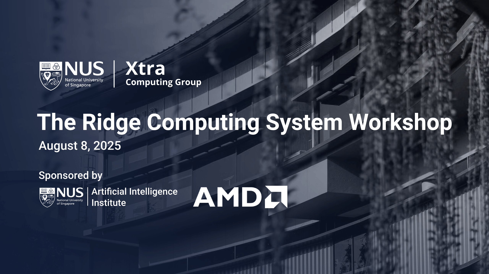
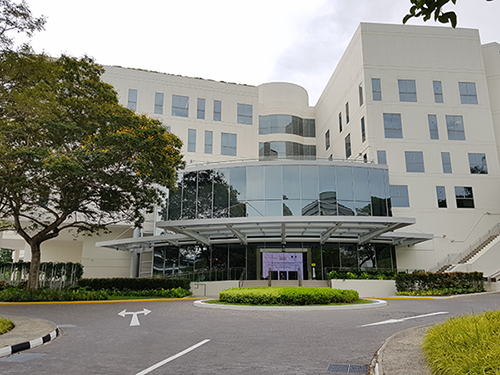

The Ridge Computing System Workshop — sponsored by [**AMD HACC @ NUS**](https://www.amd-haccs.io/nus.html) and the [**NUS AI Institute**](https://ai.nus.edu.sg/) — convened researchers, engineers, and industry leaders to chart the future of heterogeneous, high-performance systems for big-data analytics and AI.

Through invited keynotes and industry talks, participants explored real-world workloads spanning CPUs, GPUs, and adaptive accelerators; software-hardware co-design for performance-per-watt; and emerging directions in green computing.

## Date

**August 8, 2025 (Friday)**

**Time:** 09:00 – 17:10

**Venue:** I4-01-03 Seminar Room

**Address:** [3 Research Link, #01-03 i4.0 Building, Singapore 117602](https://maps.apple.com/place?place-id=ID6134A88C71A66EB&address=3+Research+Link%2C+Singapore+117602&coordinate=1.294609%2C103.7758172&name=Innovation+4.0&_provider=9902)

<a href="https://forms.gle/5QGCgcuK2P9dcGE87" class="button button--primary button--sm" target="_blank" rel="noopener noreferrer">Registration Closed</a>

<!--  -->

<!-- truncate -->

## Timetable

### Morning Session (09:00 – 12:00)

| Time | Talk & Speaker |
|------|----------------|
| 09:00 – 09:10 | **Opening Remarks** *Prof. Bingsheng He, NUS* |
| 09:10 – 09:40 | **[Data Processing on Heterogeneous Computing for Higher IT Efficiency](#data-processing-on-heterogeneous-computing-for-higher-it-efficiency)** *Prof. Gustavo Alonso, ETH Zurich* |
| 09:40 – 10:10 | **[Exploiting Data Sparsity to Improve Communication Efficiency](#exploiting-data-sparsity-to-improve-communication-efficiency)** *Dr. Haris Javaid, AMD* |
| 10:10 – 10:30 | **[RISC-V for Heterogeneous Computing](#risc-v-for-heterogeneous-computing-an-open-source-choice-for-unified-isa)** *Dr. Cui Jin, StarFive* |
| 10:30 – 11:00 | *🍵 Tea Break* |
| 11:00 – 11:30 | **[SAGE: To Simplify LLM-Augmented Reasoning on Large Clusters](#sage-to-simplify-llm-augmented-reasoning-on-large-clusters)** *Prof. Shuhao Zhang, HUST* |
| 11:30 – 12:00 | **[Model Compression for Efficient AI: From Classical Methods to Quantum Opportunities](#model-compression-for-efficient-ai-from-classical-methods-to-quantum-opportunities)** *Dr. Tao Luo, A\*STAR* |
| 12:00 – 13:30 | *Lunch* |

### Afternoon Session (13:30 – 17:10)

| Time | Talk & Speaker |
|------|----------------|
| 13:30 – 14:00 | **[Is Now the Time to Deploy Spatial Architectures in the Datacenter?](#is-now-the-time-to-deploy-spatial-architectures-in-the-datacenter)** *Assoc. Prof. Trevor E. Carlson, NUS* |
| 14:00 – 14:30 | **[BG3: A Cost Effective and I/O Efficient Graph Database in ByteDance](#bg3-a-cost-effective-and-io-efficient-graph-database-in-bytedance)** *Dr. Cheng Chen, ByteDance* |
| 14:30 – 15:00 | **[Smart Network-enhanced LLM Systems](#smart-network-enhanced-llm-systems)** *Prof. Zeke Wang, ZJU* |
| 15:00 – 15:30 | *🍵 Tea Break* |
| 15:30 – 16:00 | **[AxCore: A Quantization-Aware Approximate GEMM Unit For LLM Inference](#axcore-a-quantization-aware-approximate-gemm-unit-for-llm-inference)** *Asst. Prof. Xinyu Chen, HKUST-GZ* |
| 16:00 – 16:30 | **[Efficient LLM Full Fine-Tuning and Serving on Single GPU](#efficient-llm-full-fine-tuning-and-serving-on-single-gpu)** *Assoc. Prof. Zeyi Wen, HKUST-GZ* |
| 16:30 – 17:00 | **[Melding Serverless and Conventional Microservice Control Planes](#melding-serverless-and-conventional-microservice-control-planes)** *Asst. Prof. Dmitrii Ustiugov, NTU* |
| 17:00 – 17:30 | **[High-Performance Graph Random Walk on FPGAs](#high-performance-graph-random-walk-on-fpgas)** *Mr. Hongshi Tan, NUS* |
| 17:30 – 17:40 | **Closing Remarks** *Prof. Bingsheng He, NUS* |

---

## Talks & Speakers

### Data Processing on Heterogeneous Computing for Higher IT Efficiency

**Prof. Gustavo Alonso** · ETH Zurich, Department of Computer Science

Gustavo Alonso leads the Systems Group at ETH Zurich and heads the AMD HACC (Heterogeneous Accelerated Compute Cluster) deployment with hundreds of worldwide users. An ACM Fellow and IEEE Fellow, he has received four Test-of-Time Awards spanning databases, middleware, software runtimes, and mobile computing.

General-purpose architectures are inherently inefficient for today's data volumes and AI-driven applications. This talk argues for specialization and scale-up architectures in the cloud, where heterogeneity is key. Alonso discusses how combining the best characteristics of CPUs, GPUs, and custom accelerators can improve energy efficiency for large-scale AI and data analytics — illustrated through **Maximus** and **Eiger**, ETH Zurich's latest efforts in heterogeneous hardware exploitation.

---

### Exploiting Data Sparsity to Improve Communication Efficiency

**Dr. Haris Javaid** · Director of Research and Advanced Development, AMD Singapore

Haris Javaid leads a team of Ph.D. researchers at AMD Singapore exploring AI and Networked Systems. He holds a Ph.D. from UNSW Australia and previously worked at Xilinx Singapore and Google USA.

As ML models grow larger, distributed training and inference must minimise not just compute but communication overhead. This talk presents ongoing research that leverages **inherent sparsity in ML models** to significantly reduce communication time in distributed systems, sharing initial results and key findings.

---

### RISC-V for Heterogeneous Computing: An Open-Source Choice for Unified ISA

**Dr. Cui Jin** · Chief Architect, StarFive International

Cui Jin brings 13 years of industry experience across Intel and Huawei, spanning embedded systems to high-performance computing. He leads CPU architecture exploration and IP development at StarFive.

With 15 years of development, RISC-V has gained steady market share and now bears potential as a **unified ISA** orchestrating heterogeneous elements — CPU, GPU, NPU, and more. The talk covers RISC-V's SIMD, vector, and matrix extensions for AI/ML; its customizable instruction set for user-defined acceleration; and how its open-source community reduces development costs across the heterogeneous computing ecosystem.

---

### SAGE: To Simplify LLM-Augmented Reasoning on Large Clusters

**Prof. Shuhao Zhang** · School of Computer Science and Technology, HUST

Shuhao Zhang leads the IntelliStream research group, focusing on high-performance stream processing, large-scale inference systems, and memory-efficient computation. He received his Ph.D. from NUS and previously worked with the database systems group at TU Berlin.

Real-world LLM applications — AIOps, customer service, robotics — demand systems supporting multi-step dialogue, knowledge retrieval, and agent collaboration in real-time. **SAGE** is a dataflow-native inference framework integrating *dataflow orchestration*, *programmable memory*, *resource-aware scheduling*, and *full-stack observability* into a unified execution engine, outperforming traditional message-driven multi-agent frameworks.

---

### Model Compression for Efficient AI: From Classical Methods to Quantum Opportunities

**Dr. Tao Luo** · Senior Research Scientist & Group Lead, IHPC, A\*STAR

Tao Luo received his Ph.D. from NTU Singapore and leads research at A*STAR's Institute of High Performance Computing, with interests in green AI, quantum computing, and hardware-software co-exploration.

Deploying AI on resource-constrained hardware requires aggressive compression. This talk charts a trajectory from **energy-aware compression using reinforcement learning**, to **on-device quantized training**, and finally to **quantum annealing** as a novel approach to framing compression as an optimization problem — highlighting efficiency gains, classical limitations, and quantum computing's potential.

---

### Is Now the Time to Deploy Spatial Architectures in the Datacenter?

**Assoc. Prof. Trevor E. Carlson** · Department of Computer Science, NUS

Trevor Carlson co-designed the widely-used Sniper Multi-core Simulator. His work has appeared at ASPLOS, ISCA, MICRO, DAC, and USENIX Security, earning seven Best Paper Awards or Nominations. He holds Amazon, Intel, Microsoft, and VMware Research Awards.

Spatial accelerators like FPGAs offer massive parallelism, reconfigurability, low latency, and energy efficiency — yet few hyperscalers have deployed them broadly. This talk reviews Microsoft Catapult and other deployment examples, examines the transition from FPGA to ASIC for AI (e.g., BrainWave), and argues that **with the right interfaces and programming models, spatial architectures remain a strong general-purpose acceleration contender**.

---

### BG3: A Cost Effective and I/O Efficient Graph Database in ByteDance

**Dr. Cheng Chen** · Tech Lead, ByteGraph Team, ByteDance

Cheng Chen received his Ph.D. from NUS. He has published ~40 papers with 1,400+ citations, received Best Paper Runner-up at EuroSys 2024 and Best Industry Paper Runner-up at VLDB 2023, and serves on PC for VLDB 2025, SIGMOD 2024, and ICDE 2025.

ByteDance applications (Douyin, Toutiao) generate massive graph data daily. **BG3 (ByteGraph 3.0)** addresses growing scale and complexity through: (1) a query-efficient storage engine using BW-tree indices and cloud storage, (2) workload-aware space reclamation for better utilisation, and (3) a lightweight synchronisation mechanism for real-time consistency — significantly reducing costs while supporting fast, large-scale graph processing globally.

---

### Smart Network-enhanced LLM Systems

**Prof. Zeke Wang** · ZJU100 Young Professor, Computer Science, Zhejiang University

Zeke Wang received his Ph.D. from Zhejiang University, with postdoc stints at NTU/NUS and ETH Zurich. His research focuses on hyper-heterogeneous computing platforms for LLM systems with in-network computing.

Simple GPU-only LLM systems suffer severe I/O bottlenecks. This talk proposes **hyper-heterogeneous LLM systems** where communication and storage are offloaded from GPUs to the network (SmartNIC, SmartSwitch), leaving GPUs purely for computation — maximising GPU utilisation and closing the gap between compute power and data movement demands.

---

### AxCore: A Quantization-Aware Approximate GEMM Unit For LLM Inference

**Asst. Prof. Xinyu Chen** · Microelectronics Thrust, HKUST (Guangzhou)

Xinyu Chen received his Ph.D. from NUS and previously worked as Principal Engineer at HiSilicon on next-generation DPU accelerators. His work appears at MICRO, FPGA, DAC, and TRETS.

Transformer-based LLMs rely heavily on FP-GEMM, which dominates compute and bandwidth. **AxCore** combines weight-only quantization with floating-point multiplication approximation (FPMA) to eliminate multipliers entirely, replacing them with low-bit integer additions in a novel systolic array. Results on open-source LLMs show **6.3×–12.5× higher compute density** than conventional FP GEMM units, and 53%–70% improvement over state-of-the-art INT4 accelerators.

---

### Efficient LLM Full Fine-Tuning and Serving on Single GPU

**Assoc. Prof. Zeyi Wen** · HKUST (Guangzhou)

Zeyi Wen is a recipient of the IEEE TPDS 2019 Best Paper Award and serves as AE for JMLR's open-source software section. He previously held a lectureship at the University of Western Australia and was a postdoc at NUS and the University of Melbourne.

Fine-tuning LLMs demands memory that exceeds most GPUs. **SlideFormer** addresses this with two innovations: a *Layer Sliding Mechanism* and *Asynchronous Offloading Technology*, supporting dual offload to CPU memory and NVMe storage. The system enables fine-tuning of **123B+ parameter models on a single RTX 4090**, achieving >95% peak performance while delivering **1.40–6.27× throughput improvement** and ~50% memory reduction over baselines.

---

### Melding Serverless and Conventional Microservice Control Planes

**Asst. Prof. Dmitrii Ustiugov** · NTU Singapore

Dmitrii received his Ph.D. from the University of Edinburgh and was a Postdoctoral Researcher at ETH Zurich. His work is published at OSDI, ASPLOS, and ISCA, and he was recognised by MIT TechReview Asia-Pacific 2024 Top 35 (Visionary).

Kubernetes is too slow for volatile serverless demands, yet moving to specialised systems loses compatibility with rich cluster management features. **PulseNet** solves this with a dual-track design: predictable traffic is handled by standard, full-featured instances through the conventional control plane, while sudden bursts trigger a fast path using node-local agents to rapidly spawn lightweight emergency instances. Results show **1.5–3.5× faster performance** and up to **70% cost reduction** — with >98% of invocations handled by the standard Kubernetes path.

---

### High-Performance Graph Random Walk on FPGAs

**Mr. Hongshi Tan** · PhD Student, NUS (supervised by Prof. Bingsheng He and Prof. Weng-Fai Wong)

Hongshi Tan's research focuses on FPGA-based heterogeneous systems for large-scale graph processing and graph representation learning. His work has been published at SIGMOD, ICS, MICRO, FPGA, and DAC.

This talk presents two FPGA accelerators for graph random walk: **LightRW**, designed for dynamic random walks with a hardware-efficient parallel reservoir sampling algorithm; and **RidgeWalker**, a general-purpose, perfectly pipelined architecture supporting a wide range of random walk algorithms. By combining Markov-based task decomposition with asynchronous execution, RidgeWalker eliminates pipeline bubbles and achieves near-optimal performance on HBM-equipped FPGAs.

---

## Organizers & Contact

**Yao Chen** · Research Assistant Prof., NUS · [yaochen@nus.edu.sg](mailto:yaochen@nus.edu.sg)

**Hongshi Tan** · PhD Student, NUS · [hongshi@u.nus.edu](mailto:hongshi@u.nus.edu)

**Junyi Hou** · PhD Student, NUS · [e0945797@u.nus.edu](mailto:e0945797@u.nus.edu)
